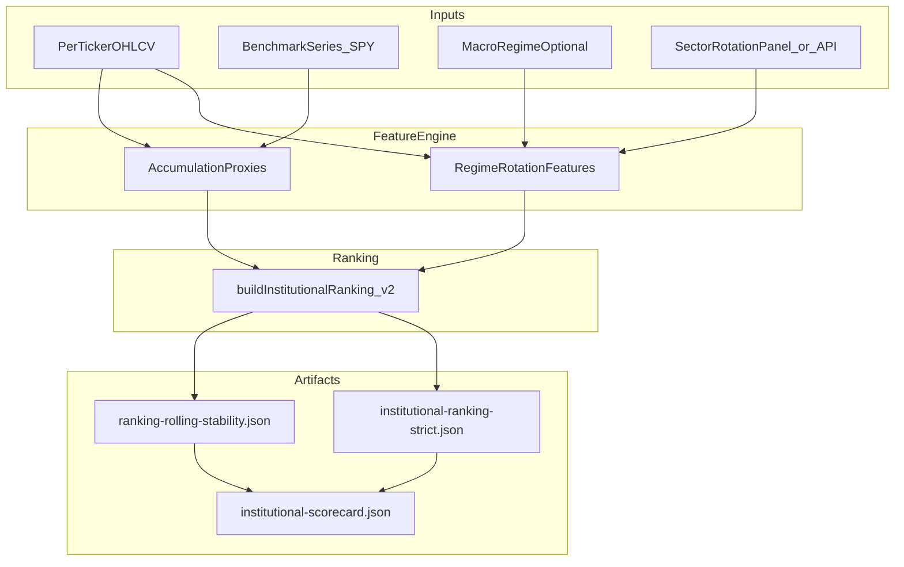

# Phase 2 ranking, scorecard gates, rolling promotion, Opus review loop

**Stored for handoff.** This document mirrors the Cursor plan *Ranking Phase 2 + Gates* (2026-04). Implement from here when you leave plan-only mode.

## Goals

- Enrich ranking beyond return/OOS/timing microstructure: **regime-aware rotation** (risk-on/off context) and **sector leadership persistence**, plus **pre-breakout accumulation proxies** (heuristic, test-backed, no guaranteed alpha).
- Make ranking quality **mandatory** in the institutional pipeline: new scorecard checks for **ranking precision**, **OOS hit-rate**, and **drawdown-constrained alpha** (definitions below).
- Add a **rolling-window stability** artifact so “promotion” (release readiness) only passes when strict-qualified picks are **consistent**, not one-off — implemented as **gated scripts/artifacts** (not silent production deploys).
- Update the canonical plan with a **repeatable Opus review step** so high-value platform ideas become tracked work items.

## Current anchors in repo

- Ranking core: [`lib/alpha/institutionalRanking.ts`](lib/alpha/institutionalRanking.ts) (`buildInstitutionalRanking`, `InstitutionalRankingInput`).
- Strict ranking artifact: [`scripts/ranking-strict-backtest.ts`](scripts/ranking-strict-backtest.ts) → `artifacts/institutional-ranking-strict.json`.
- Scorecard today reads only matrix windows: [`scripts/scorecard-evaluate.ts`](scripts/scorecard-evaluate.ts) + thresholds in [`config/institutional-gates.json`](config/institutional-gates.json).
- Canonical next-session plan to extend: [`docs/NEXT_SESSION_PLAN_2026-04.md`](NEXT_SESSION_PLAN_2026-04.md).

## Architecture (data flow)

## Feature design (implement as pure functions + tests)

### 1) Regime-aware rotation + sector leadership persistence

- Add [`lib/alpha/rankingRegimeFeatures.ts`](lib/alpha/rankingRegimeFeatures.ts) (name flexible) exporting something like `computeRegimeRotationContext({ closes, benchmarkCloses, sectorScores? })`.
- **Risk-on/off proxy**: reuse existing intermarket/regime utilities if present in this workspace (per `AGENTS.md`: `lib/quant/intermarket.ts`, `lib/quant/regimeDetection.ts`, `lib/quant/sectorRotation.ts`). If files are missing on this branch, add **thin adapters** that read the same signals already exposed by [`app/api/sector-rotation/route.ts`](app/api/sector-rotation/route.ts) (prefer importing shared lib over duplicating Yahoo calls).
- **Sector leadership persistence**: score sector momentum rank stability over last N weeks (e.g., fraction of weeks in top quartile). Feed as a scalar feature into ranking, not a hard override.

### 2) Pre-breakout accumulation proxies (conservative, explainable)

- Add [`lib/alpha/accumulationProxies.ts`](lib/alpha/accumulationProxies.ts) computing a bounded `accumulationScore01` from **only** price/volume/volatility shape, e.g.:
  - volatility compression (ATR percentile or short/long ATR ratio),
  - volume dryness then expansion (rolling z-score capped),
  - relative strength vs benchmark trend (slope of ratio),
  - range contraction breakout distance (bounded).
- Each sub-signal returns a component + reason string for UI transparency.

### 3) Ranking v2 composition

- Extend [`lib/alpha/institutionalRanking.ts`](lib/alpha/institutionalRanking.ts) (or add `institutionalRankingV2.ts` + re-export) to accept optional `context` fields:
  - `regimeScore`, `sectorPersistenceScore`, `accumulationScore`, each clamped 0..1.
- Rebalance weights so **profit-first remains primary**, but fragile names cannot rank high without context alignment (exact weights tuned with tests + benchmark guard).

## Scorecard: mandatory ranking gates

Extend [`config/institutional-gates.json`](config/institutional-gates.json) with explicit numeric thresholds (names illustrative; adjust during implementation):

- **R1_ranking_precision**: top-K precision of `accumulate` names vs a defined forward proxy (initially: next-window OOS median return > 0 among top K, evaluated on rolling splits produced by the new script — avoids claiming live alpha).
- **R2_oos_hit_rate**: fraction of rolling windows where average OOS return of top-K `accumulate` set is positive.
- **R3_dd_constrained_alpha**: max drawdown of a hypothetical equal-weight top-K portfolio must be below ceiling **or** alpha vs benchmark must exceed floor under DD cap.

Update [`scripts/scorecard-evaluate.ts`](scripts/scorecard-evaluate.ts) to ingest:

- `artifacts/backtest-matrix.json` (existing),
- `artifacts/institutional-ranking-strict.json` (existing),
- **new** `artifacts/ranking-rolling-stability.json`.

Keep `overallPass` as `AND` across all checks; document any optional CI profile separately (per existing Phase B idea in the next-session plan doc).

## Rolling consistency + “auto-promote” (release gate, not magic deploy)

- Add [`scripts/ranking-rolling-stability.ts`](scripts/ranking-rolling-stability.ts):
  - For each rolling train/test window (reuse walk-forward windowing constants from engine: 252/63 or configurable),
  - build ranking on train slice labels but evaluate forward test metric on test slice **without lookahead** (concrete evaluation protocol coded + documented in script header),
  - emit `artifacts/ranking-rolling-stability.json` with `passesConsistency`, `windows`, `topK`, `hitRate`, `precision`, `maxDdTopK`.
- Extend [`scripts/loop-mission.ts`](scripts/loop-mission.ts) to run `ranking-rolling-stability` before scorecard (or fold into scorecard step — pick one to avoid double maintenance; **prefer single orchestrator**: loop mission runs stability script then scorecard).

**Auto-promote policy**: treat “promote” as `artifacts/promotion_decision.json` written only when scorecard + stability pass; Vercel prod remains manual per existing checklists.

## Testing / review / optimization

- Add Vitest fixtures under `__tests__/alpha/` for:
  - accumulation proxy monotonicity / bounds,
  - regime feature stability on synthetic series,
  - ranking ordering invariants.
- After touching `lib/quant/*` or `lib/backtest/*`, run `npm run benchmark` (hard floor in `AGENTS.md`).
- Add `npm run` entries in [`package.json`](package.json) for the new scripts.

## Plan maintenance: Opus 4.7 review loop (process, not runtime dependency)

Update [`docs/NEXT_SESSION_PLAN_2026-04.md`](NEXT_SESSION_PLAN_2026-04.md) with a new section **“Opus architecture delta (human-applied)”**:

- Cadence: weekly or at phase boundaries.
- Inputs: current artifacts + diff summary.
- Output: human pastes Opus recommendations into [`docs/ARCH_REVIEW_LOG.md`](ARCH_REVIEW_LOG.md) (new) using a strict template: `date`, `decision`, `accepted_items`, `rejected_items`, `owner`, `merged_into_plan_section`.
- Merge rule: accepted items become **checkboxes** in `NEXT_SESSION_PLAN` Phase C–E; rejected items recorded with rationale (prevents silent scope creep).

Also update [`memory/project_status.md`](../memory/project_status.md) resume pointer to mention Phase 2 ranking + new gates.

## Implementation order (minimize rework)

1. Rolling stability script + artifact schema (defines measurable gates).
2. Feature modules (`rankingRegimeFeatures`, `accumulationProxies`) + unit tests.
3. Ranking v2 integration + update strict ranking script to emit richer rows (explainability fields).
4. Scorecard + gates JSON + loop mission wiring.
5. UI: extend ranking board to show new sub-pillars (small, localized change in [`components/zones/InstitutionalRankingBoard.tsx`](../components/zones/InstitutionalRankingBoard.tsx)).
6. Plan docs: append Phase 2 section + Opus review process + link `ARCH_REVIEW_LOG.md`.

## Risks / mitigations

- **Lookahead risk** in accumulation/regime features: enforce “signal at t, evaluate at t+1” consistent with engine’s execution model.
- **Overfitting ranking weights**: calibrate primarily on rolling evaluation, not single full-sample backtest.
- **Missing upstream modules**: verify paths at implementation start; prefer importing shared quant libs over duplicating Yahoo calls.

## Work checklist (from plan todos)

- [ ] Add `scripts/ranking-rolling-stability.ts` → `artifacts/ranking-rolling-stability.json` + protocol in header.
- [ ] `lib/alpha/rankingRegimeFeatures.ts` + `lib/alpha/accumulationProxies.ts` + benchmark wiring.
- [ ] Ranking v2 + update `scripts/ranking-strict-backtest.ts`.
- [ ] Extend `config/institutional-gates.json` + `scripts/scorecard-evaluate.ts` (R1/R2/R3).
- [ ] Update `scripts/loop-mission.ts` + `package.json` scripts; optional `artifacts/promotion_decision.json`.
- [ ] `__tests__/alpha/*` + benchmark when quant/backtest touched.
- [ ] `InstitutionalRankingBoard` sub-pillars.
- [ ] Merge Phase 2 + Opus loop into `NEXT_SESSION_PLAN_2026-04.md` + `ARCH_REVIEW_LOG.md` + `project_status.md`.
